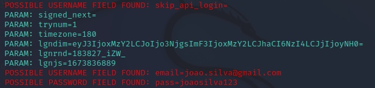

# Dessafio do bootcamp de  cibersecurity da DIO - Phishing para captura de senhas do facebook

### Ferramentas

Oracle VM com:
- Kali Linux
- setoolkit

## Construção do Phishing no Kali Linux

### Configuração da VM 

- Rede da VM como: Bridged Adapter

### Comandos
- Acesso root: ``` sudo su ```
- Iniciando o setoolkit: ``` setoolkit ```
- Tipo de ataque: ``` Social-Engineering Attacks ```
- Vetor de ataque: ``` Web Site Attack Vectors ```
- Método de ataque: ```Credential Harvester Attack Method ```
- Método de ataque: ``` Site Cloner ```
- Obtendo o endereço da máquina: ``` [Enter] ```
- URL para clone: http://www.facebook.com

### Resutados


